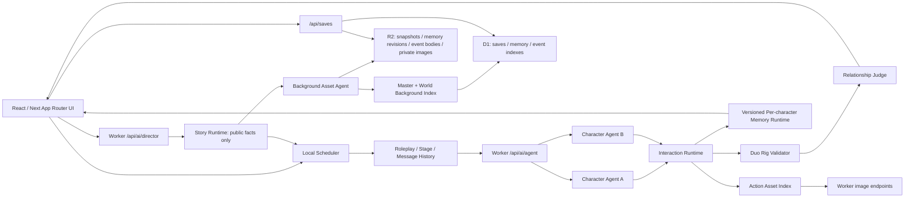

# CP 跳动 / Couple DANCE 项目交接手册

> 交接基线：2026-07-21
>
> 当前产品：自然模式与导演模式进入前二选一；进入后模式锁定
>
> 公开快照不绑定生产站点；部署前请配置自己的 Sites 项目、D1 和 R2。
>
> 领域规则：[AGENT_ARCHITECTURE.md](./AGENT_ARCHITECTURE.md)

## 0. 接手者先读这里

这是一个已经能部署、能存档、能调用真实 Character Agent 的像素关系模拟原型，不是静态页面。

当前最短闭环：

创建流程固定为“同一页面完成角色建档与可交互动作角色 → 实时互动预览 → 绑定双向关系网 → 进入前选择自然模式或导演模式”。

```text
入口选择已有世界 / 已有角色 / 从 0 创建
  → 在同一页面为 1–3 人建档并制作可交互动作角色
  → 所有角色 ready 后解锁关系网
  → 在实时动作预览中编辑 A→B、B→A 和共同经历
  → 选择自然模式，或填写故事框架后进入导演模式
  → 进入后模式固定，顶部不提供切换
  → 独立角色 Agent 产生动作、回应、关系变化和各自主观记忆
  → 保存世界专属记忆，并向独立角色档案同步设定与形象
```

接手后的第一轮操作建议：

1. 确认 Node.js 版本不低于 `22.13.0`。
2. 运行 `npm install`，不要更换现有包管理器或锁文件。
3. 从 `.env.example` 创建本地 `.env.local`；不要把真实密钥写进代码、文档或 Git。
4. 运行 `npm test`，它会执行生产构建、类型检查和自动回归测试。
5. 再读本文件的“已知边界”和 [Agent 架构规则](./AGENT_ARCHITECTURE.md)，然后开始修改。

维护或回归时不要主动调用真实图像生成。只有项目所有者明确要求，或用户在产品界面主动点击生成时，才允许产生真实图像调用；自动测试必须继续使用模拟响应。

## 1. 产品目标与非目标

### 1.1 产品目标

CP 跳动 / Couple DANCE 让玩家创建角色和初始关系。自然模式不预写剧情；导演模式允许 Director Agent 编排大纲、场景和公开世界事件，但仍不替角色写行为。两种模式中，角色都依据自己的人格、状态、目标、记忆、对关系的主观理解和当前可见信息，自主决定行动、语言、沉默、靠近、拒绝和离开。

系统的核心价值不是“自动写故事”，而是让不同角色的主观状态在同一个世界中持续演化，同时保留同意、边界和记忆隔离。

### 1.2 当前明确不做

- 不允许 Director Agent 扮演角色、生成角色台词、读取私有记忆、直接改关系，或把隐藏大纲/结局目标交给 Character Agent。
- 不允许一个模型一次写完双方行为。
- 不把物理靠近、动画播放或关系预览当成同意。
- 不允许模型直接写好感、信任等关系数值。
- 不允许 Director 或维护脚本直接生成背景；自动场景匹配无合适资产时只能交给独立 Background Asset Agent 生成、持久化和登记。
- 不让第三个角色自动参与一组接触动作；多人可共享对话和活动场景，但身体接触仍一次只处理一对角色并逐一请求同意。

## 2. 当前完成度

| 能力 | 状态 | 当前实现 |
| --- | --- | --- |
| 品牌入口 | 已完成 | 已有世界、已有角色、从 0 创建三条入口 |
| 三步创建向导 | 已完成 | 建档与制作 → 互动关系网 → 进入世界 |
| 1–3 人建档 | 已完成 | 名字和背景必填，性格可选；加入后自动保存角色档案 |
| 可选角色考据 | 已完成 v3 | 玩家主动搜索 Wikipedia/Wikidata 与萌娘百科；按作品范围排除消歧义/非人物页，必要时只用文本 Agent 纠正角色别名后重搜；确认页面后读取整页可见正文并分段覆盖全文提炼，界面显示读取覆盖率；多源草稿逐条编辑或确认，再与玩家原始资料蒸馏为可编辑的最终 Profile 预览；只有玩家应用预览后才写入角色档案/Agent 上下文，未确认项不保存；萌娘百科持久保存署名和非商业许可；关闭时零搜索请求 |
| 可交互角色制作 | 已完成 | 参考图 → 4×5、20 帧三朝向基础动作表 → 前景智能分帧 → 完整性/朝向 QA → 7 点骨骼 |
| 关系网互动预览 | 已完成 | 预览交谈、招呼、靠近、心动；选择关系边切换角色对 |
| 双向关系初值 | 已完成 | 每条边保存 A→B、B→A 和共同经历 |
| 模式选择与锁定 | 已完成 | 第三步进入世界前选择自然模式或导演模式；进入后顶部只展示当前模式，不提供切换；旧存档缺少 `mode` 时按自然模式恢复 |
| 自然模式 | 已完成 | 注意力调度器按待回答问题、连续对话、多人参与状态、距离、行动间隔和未完成事项唤醒角色 |
| 导演模式 Phase 1 | 已完成 | `/api/ai/director` 建立大纲并按至少 4 个角色回合冷却评估公开证据；玩家可提交世界事件、剧情方向或场景请求；Story Runtime 只提交公开事实，随后复用相同 Character Agent 链路 |
| 导演上下文压缩 | 已完成 v1 | `cp-dance/story-public-event/v1` 永久追加公开事实；Story Context Compactor 按 6000/8000-token 与 24/32-KB 阈值、场景/节拍/重排/旧存档边界生成可追溯摘要；硬阈值先阻断 Director，失败缩小范围重试后使用无补写确定性回退 |
| 真实 Character Agent | 已完成 | `/api/ai/agent`；先调用局部焦点角色，再为每个需要回应的接收者分别调用 |
| 同意与边界 | 已完成 | 接触、双人动作和敏感话题必须请求并独立回应 |
| 空间感知 | 已完成 | 相对距离语义、可视朝向、目标、百分比舞台坐标；交互会话在整个生命周期持续维护双方相向，普通说话和观察不重排位置 |
| 关系裁判 | 已完成 | 根据已发生的可见结果分别更新两个方向 |
| 角色表演上下文 | 已完成 v6 | 玩家填写的 `Character Profile v2`、玩家采用的 `Character Reference Pack v1`、每个 A→B 的定性 Relationship Lens、Stage、角色私有历史、Public Dialogue 与 Group Scene；导演模式只增加公开场景、事件、实体、状态和环境能力 |
| 连续公开对话 | 已完成 v1+ | 保存最多三人的逐字台词、公开动作、非语言节拍、指向对象、公开听众、参与状态、话题、最多十二个连续节拍和待回答问题 |
| 多人共享场景 | 已完成 v1 | `cp-dance/group-scene/v1`；同一句话可指向一人、选定多人或全场，每名接收者独立回应/观察/退出，不生成群体关系分 |
| 主观记忆 | 已完成 v1+ | `general / characters / topics` 版本化文档，加具体措辞、承诺、偏好、边界和未完成问题等角色感回调线索 |
| 世界与角色存档 | 已完成原型 | D1 保存聚合、记忆和事件索引；R2 保存版本快照、不可变 revision/事件体和内容寻址图片 |
| 动作资产补全 | 已完成原型 | 缺失动作后台生成，当前回合先用基础动作回退 |
| 背景资产总索引 | 已完成 v1 | `cp-dance/background-catalog/v1`；公开快照使用空目录，部署者只可登记自有或已获授权的背景 |
| 世界背景索引 | 已完成 v1 | `cp-dance/background-world-index/v1` 保存当前世界使用过的背景、场景绑定和当前资产；D1 同步 owner/world/asset 关系 |
| Background Asset Agent | 已完成 v2 | `/api/ai/background` 优先解析并复用总索引；找不到合适资产时自动调用图像生成、存 R2，并同步更新总索引与世界索引 |
| 通用双人骨骼 | 已完成 | 7 点骨骼、身高差、缩放和接触残差校验 |
| 双人交互会话 | 已完成 | 发起者/接收者、同意、空间等级、双方动作、关键阶段、匹配结果和恢复状态均有显式会话 |
| 两阶段空间对齐 | 已完成 | 正常移动分步接近，再在最大根节点修正范围内做骨骼细对齐；检查边界和第三人碰撞 |
| 关键阶段同步 | 已完成原型 | 双方按 `prepare → contact_start → contact_hold → contact_end → recover` 对齐，不要求逐帧等长 |
| 沉浸剧场 | 已完成 | 网页剧场铺满当前视口，隐藏角色、关系、卷轴、记忆和状态面板；保留运行控制，按钮或 `Esc` 可退出，进入桌宠时自动恢复普通页面 |
| 桌宠模式 | 已完成 MVP | macOS/Windows 主显示器透明置顶层；展示表层与 Agent 运行开关相互独立，网页控制开始/停止；角色拖拽/短暂点击、拖近后双方独立情绪与台词判断、只显示一次真实 Agent 台词、缺失表情/动作后台增量生成并写卷轴、超过 50% 重叠时柔和微调、命中区穿透看门狗；停止交互后才允许玩家显式保存 |
| 任意双人合成图 | 未完成 | 当前舞台组合两名单角色资产，没有生成统一双人 Sprite Sheet |
| 服务端任务队列 | 未完成 | 动作补全由浏览器调度，关闭页面后不会继续执行 |
| 存档版本恢复 UI | 未完成 | 后端保留版本，但页面只读取最新版本 |

## 3. 当前架构



职责边界：

| 模块 | 可以决定 | 不可以决定 |
| --- | --- | --- |
| Scheduler | 本轮唤醒谁、为谁组装上下文 | 角色的动作、语言和情感结果 |
| Director Agent | 大纲、剧情节拍、场景和公开世界事件提议 | 角色台词、动作、私有想法、同意、关系结果和角色结局选择 |
| Story Runtime | 校验导演输出并提交公开事实，按可见范围建立角色注意力任务 | 把隐藏大纲、结局目标或导演理由发给 Character Agent；绕过同意协议 |
| Character Agent | 自己的一个动作、公开表达、私有想法和记忆写入建议 | 另一角色的行为、关系数值、世界最终状态 |
| Interaction Runtime | 请求—回应是否合法、空间动作如何执行 | 角色是否愿意、是否喜欢对方 |
| Duo Rig Validator | 接触点、缩放、身高差和安全降级 | 用几何结果推断情感同意 |
| Relationship Judge | 根据真实结果更新 A→B 与 B→A | 接受模型直接写入数值 |
| Memory Runtime | 检索私有文档，验证证据、baseRevisionId 与实际读取记录，再提交 revision | 把一人的私人记忆发给另一人；让模型直接覆盖已有内容 |
| Character Asset Agent | 生成或补充动作资产 | 决定角色下一回合是否仍使用该动作 |
| Background Asset Agent | 查询背景总索引、复用场景资产；无合适资产时生成并登记新背景 | 控制角色、修改关系、读取私有记忆、把图像密钥或索引写权限交给 Director |

## 4. 目录与文件职责

```text
app/
├── page.tsx                    入口、三步向导、模式选择、双模式 UI、存档调用、回合调度
├── RelationshipGraphEditor.tsx 关系编辑和已完成角色的互动预览
├── PixelPetForge.tsx          参考图、基础动作表、增量动作、QA 与制作状态
├── PixelPetSprite.tsx         Sprite Sheet 播放和单角色交互控件
├── pixel-pet-runtime.ts       浏览器图像归一化、QA、骨骼分析、动作包组装
├── natural-agent-runtime.ts   两阶段角色调用和缺失动作后台任务
├── story-director-runtime.ts  独立 Director Agent 浏览器调用
├── background-agent-runtime.ts 只执行背景 resolve；不会从舞台自动发起 generate
├── layout.tsx                 页面元数据、字体、OG 信息
└── globals.css                全站样式与响应式布局

desktop/
├── main.mjs                   Electron 透明窗口、本机 HTTP 接力、状态中继和来源校验
├── preload.cjs                context-isolated 最小桌面能力桥
├── bridge-core.mjs            接力 schema、白名单、CORS/PNA 与数据校验
└── bridge-core.test.mjs       不启动图形窗口的桌面协议测试

lib/
├── agent-engine.ts            GameState、双模式 reducer、Story Runtime、自然规则回退、空间、阶段历史、记忆与关系提交
├── director-types.ts          导演任务、状态、剧情节拍、公开事件和场景协议
├── director-runtime.ts        大纲状态、冷却、玩家方向分类与公开任务组装
├── story-context-types.ts     公开事件、摘要 revision、预算、运行状态与压缩任务协议
├── story-context.ts           触发、连续范围、置顶上下文、验证、回退与旧存档恢复
├── character-memory.ts        方向记忆文档、检索、revision、认识状态、证据与读后写校验
├── roleplay.ts                玩家 Character Profile v2 与每个方向的 Relationship Lens
├── character-reference.ts     Wiki 考据包、来源/置信度、原作关系事实与方向草稿匹配
├── action-unit.ts             动作语义、角色身份、空间等级、接触约束和关键阶段元数据
├── interaction-session.ts     双人交互会话、空间蓝图、阶段和匹配结果协议
├── model-provider.ts          注意力调度、角色表演上下文、公开对话和确定性记忆检索
├── natural-agent-types.ts     Agent 任务、决策、回应和资产任务类型
├── relationship-engine.ts     可见语义信号到方向关系变化
├── duo-interaction.ts         7 点骨骼与双角色兼容性校验
├── pixel-pet.ts               角色视觉协议、基础动作和 append-only 动作包
├── background-assets.ts       背景总索引、场景匹配、准确命名和世界索引协议
├── world-save.ts              世界存档、世界记忆索引和客户端格式校验
└── character-save.ts          独立角色设定/形象存档和无世界记忆的跨世界复用

worker/
├── background-api.ts          Background Asset Agent、D1/R2 背景总索引与世界索引
├── index.ts                   Cloudflare Worker 入口；依次路由角色 AI、导演 AI、角色考据、存档、图片和 SSR
├── agent-config.ts            图像 Agent 与文本 Agent 的唯一服务端配置入口
├── ai-api.ts                  图像模型与文本模型的服务端代理和结果校验
├── director-api.ts            Director/Compactor 独立权限提示、公开任务清洗与结果归一化
├── save-api.ts                D1/R2 聚合存档、记忆/事件/故事摘要投影、版本、图片外置与 owner 隔离
├── research-api.ts            Wikipedia/Wikidata/萌娘百科搜索、消歧、正文提取、来源许可与考据 Agent
└── runtime-types.ts           Worker 运行时最小接口类型

db/schema.ts                   运行时建表 SQL
drizzle/                       Sites 部署使用的 D1 迁移
build/sites-vite-plugin.ts     构建后复制 hosting 元数据与迁移
public/pixel-pet/              素材政策说明；公开快照不附带角色、动作表或双角色示例图片
tests/rendered-html.test.mjs   SSR、存档、AI 协议和架构约束测试
docs/AGENT_ARCHITECTURE.md     不可破坏的领域规则
docs/PROJECT_HANDOFF.md        当前事实、运维、风险和接手顺序
```

## 5. 关键运行链路

### 5.1 建档与角色制作

1. 玩家可保持纯手填，或主动勾选角色考据：`/api/research/character/search` 返回 Wikipedia/Wikidata 与萌娘百科候选，排除消歧义、作品和地点等非人物页；若作品范围内没有有效人物候选，文本 Agent 只生成角色别名用于重新检索，不生成事实。玩家确认最多三个正确页面后，`/api/research/character/extract` 优先读取整页 HTML 可见文字，清理脚本、导航、页面工具和文件项，再按每段约 14000 字、最多 12 段覆盖全文提炼；解析失败的片段会自动重试一次，来源元数据和 UI 显示实际字数、章节数、分段数与截断状态。之后将多源结果合并成带证据、原页链接与许可的审阅草稿。草稿默认不选中，编辑某条会自动确认，也可直接勾选。证据区下方直接提供状态明确的“生成完整人物档案预览”按钮；`/api/research/character/distill` 只读取玩家原始资料和已确认条目，输出可继续编辑的 `Character Profile Distillation v1` 及最终 Profile 预览；只有玩家点击应用，预览中的性格、背景、角色扮演资料和已确认 Reference Pack 才写入表单。未确认内容不会进入角色档案或 Agent 记忆。萌娘百科内容必须持续显示“引自萌娘百科”、原页链接与 `CC BY-NC-SA 3.0 CN`。
2. `page.tsx` dispatch `ADD_AGENT` 或 `ADD_SAVED_AGENT`。
3. 新角色立刻形成独立 `StoryAgent`，包含初始记忆、可关闭的 `Character Reference Pack v1` 和 draft 视觉档案。
4. 同一页面的 `PixelPetForge` 接收上传图或预设图。
5. 浏览器把参考图转换为 data URL，调用 `/api/ai/character`。
6. Worker 直接使用图像通道的 `/v1/images/edits`，基础角色与增量动作都携带参考图。
7. 模型应返回精确 4×5、20 帧动作表：`idle / wave / cry / love` 都包含正面、左前侧转、右前侧转，`walk` 包含左右两组循环帧。左右侧转必须保持正面可读，不允许背面或完全侧面。参考图是人物外观与画风的最高优先级、唯一视觉事实源：锁定脸、发型、服装层次、体型、配色、非对称标志、像素密度、描边、明暗层级和材质简化；名字、性格与背景只能影响动作和情绪。基础动作与增量动作都禁止美化、换装、改比例、改色或换画风；动作与还原冲突时必须简化动作。
8. 浏览器先识别透明或纯色背景，计算行列低密度边界，再对全图前景做 8 邻域连通分析；每个角色主体及其相邻附件按最近网格中心归属到一个槽位，并保持宽高比、统一脚底基线重建每一帧。禁止固定等分或整图中心裁切。
9. AIGC 结果必须满足：完整帧 100%、边界置信至少 55%、动作差异至少 6%、独立姿势至少 8、朝向覆盖至少 55%、透明角至少 80%、背景一致性至少 85%。任一角色主体无法完整归属时 fail-closed，不登记残缺动作表。
10. 通过后保存为 `generationMode: "aigc"`；接口失败、Agent 未配置或 QA 不通过时保持原档案不变并显示可诊断错误，不再自动降级。只有用户在失败后明确点击“本地预览”才允许使用预设或本地变换，并保存为 `local-fallback`。
11. 所有角色状态都为 `ready` 后才解锁关系网。

### 5.2 关系网

- 两人以上自动生成两两关系草稿；三人有三条边。
- 每条草稿保存 `aToB`、`bToA` 和 `sharedHistory`。
- 两个角色的 Reference Pack 命中同一 QID 或别名时，只为有证据的方向生成 Lens 草稿；另一方向保持空白，玩家分别确认。
- 互动预览只播放已经完成的角色动作，不提交关系变化，也不代表同意。
- 单角色不会创建虚构关系边，可以确认后直接进入世界。

### 5.3 Character Agent 回合

1. `buildAttentionAgentTask(state)` 为所有 actor→counterpart 候选计算机会优先级；待回答问题、仍在继续的公开对话、近距离对象和未完成事项优先，最近连续行动者降权。
2. 组装 `cp-dance/character-context/v6`：玩家 Character Profile v2、玩家采用的 Character Reference Pack、当前 A→B Relationship Lens、带 `turnBrief` 与行为/请求/禁用/动画能力信封的 Stage、该角色自己的 Message History、`cp-dance/public-dialogue/v1` 逐字公开对话、`cp-dance/group-scene/v1` 多人参与状态和角色感回调线索。导演模式只在 Stage 增加公开场景、可见世界事件、可见实体、公开状态和环境能力；隐藏大纲、当前节拍、结局目标和导演理由不进入任务。System Prompt 固定按宪法、认知、回合、能力、连续性、记忆、输出七层组织；桌宠、拖拽、当前距离等只进入动态 Stage。
3. `/api/ai/agent` 返回该角色自己的一个决策。
4. `buildResponseTasks` 按三类路由处理：同意请求只路由给一个对象并必须回应；明确问题/邀请可交给一人、选定多人或全场并分别唤醒；普通观察、沉默和独自行动只写公开事件，等待后续注意力调度。
5. 接收角色被唤醒时只读取公开动作、逐字语言、非语言节拍和话题，独立决定直接回答、含蓄回应、反问、回避、沉默、拒绝、替代或离开。
6. reducer 的 `APPLY_NATURAL_AGENT_TURN` 校验权限、请求和拒绝锁；需要组合动作时建立 `cp-dance/interaction-session/v1`。
7. 空间执行器按定时阶段推进转向、正常接近、骨骼细对齐、关键阶段同步与恢复；推进期间不会唤醒新的角色回合。
8. Relationship Judge 分别更新两个方向；Memory Runtime 使用服务端回传的实际已读 revision，校验模型 `memoryProposal` 的权限、证据与 base revision，再分别写入双方文档。校验失败只记录已裁决的公开结果，不接受越权提案。
9. 每个参与者只把自己的动作、逐字语言、非语言节拍、言语行为、私有反思、公开结果和已提交 revision 追加到自己的阶段历史；公开对话另存逐字记录，另一角色不会读到该私有反思。
10. 只有具体措辞、承诺、偏好、边界、未完成问题或共同细节值得影响未来角色表达时，才写入 `roleplayCues`；缺失动作仍立即安全回退并异步生成、校验、append-only 登记。
11. 文本模型失败时，仅当前回合 dispatch `ADVANCE` 使用本地安全规则，世界不会永久停机。
12. 舞台对白不挂在会移动、缩放的角色节点上，而是进入舞台顶部独立安全层，并按角色实际 `x` 坐标从左到右排列；最多显示两行，完整逐字内容仍保存在下方 Public Dialogue。关系预览中的“动作预览不代表预设同意”只显示在预览标题区，禁止覆盖角色和动作标签。

### 5.3A Director Agent 与 Story Runtime

1. 导演模式进入前填写 `StorySetup`，`/api/ai/director` 的 `create_outline` 返回最多 8 个 Plot Beats 和公开开场；`cp-dance/director-state/v1` 保存故事状态，`cp-dance/director-decision/v1` 保存每次提议。
2. Director Agent 可以 `wait / inject_world_event / change_scene / advance_beat / revise_outline / finish_story`，但输出不包含角色台词、角色主动动作、私有想法、同意、关系变化或角色结局选择。服务端丢弃协议外字段，并把可见/受影响角色 ID 限制在当前阵容。
3. Story Runtime 把合法事件写成公开卷轴事实并分别加入 `storyAttentionQueue`。后续仍调用相同的 Character Agent、Interaction Runtime、Relationship Judge 和 Memory Runtime；导演模式没有第二套角色行为引擎。
4. 普通 Director 评估至少间隔 4 个角色回合；玩家提交方向时可立即调用。确定性分类只决定输入属于强制世界事实、剧情指导还是场景请求，不直接执行内容。
5. `sceneProposal` 先归一化为 `story-room / story-station / story-seaside / story-rooftop / story-corridor` 场景语义，再由 Background Asset Agent 查询背景总索引并优先复用已有资产；无合适匹配时自动调用背景生成，失败才继续使用安全预设样式。进行中的双人 Interaction Session 不允许场景切换。
6. 背景生成仍不是 Director 能力。`resolve` 无匹配时由 Background Asset Agent 自己调用图像通道；成功顺序固定为 R2 写入 → D1 总索引与世界索引批量写入，返回前两级索引均已更新。保留的手动 `generate` 操作仍要求所有者明确确认。
7. 自然/导演模式只在进入世界前选择。故事存档与自然存档走相同 `/api/saves`；旧存档缺少 `mode` 时按自然模式，故事存档必须携带有效导演状态才能恢复为 story。

### 5.3B Story Context Compactor

1. `storyPublicEvents` 使用 `cp-dance/story-public-event/v1` 按时间永久追加。它与页面卷轴同源但不受卷轴展示条数限制；摘要只改变下一次 Director 输入，不删除、改写或替代原始事实。
2. 未压缩尾部达到约 6000 tokens / 24 KB 后在当前安全回合结束时软触发；达到 8000 tokens / 32 KB 后硬阻断新的 Director 调用与大纲重排。场景切换、Plot Beat 完成、重排大纲前和旧导演存档恢复也会强制触发。
3. Director 输入固定为：约 1600-token 稳定摘要、尚未压缩的连续公开尾部、结构化置顶上下文、当前 Scene/Beat/Outline；每次压缩完成后保留最近最多 12 个且约 1800-token 的原始节拍。总预算目标约 12000 tokens，并绑定 `summaryRevisionId / outlineBaseRevision / coveredThroughEventId`。
4. Compactor 与 Director 使用同一 `NEWAPI_TEXT_*` 通道，但 `taskType: compact_story` 使用独立 System Prompt。输入只允许上版稳定摘要、本批连续公开事件、未回答问题、活跃请求、公开实体/状态、未解线索、pending 玩家指令和 Runtime 已判定的 Beat 条件；禁止私有想法、私有记忆、精确关系数值、模型推理和未来计划。尚未进入本批连续范围的 pending 玩家指令不写入摘要，仍由最近原始尾部与置顶上下文交给 Director。
5. 服务端归一化真实事件 ID、Runtime 条件与置顶事实；客户端提交前再验证 schema、base revision、连续 coverage、每个输入事件引用、未回答问题、范围内 pending 玩家指令和私有片段。模型失败或输出无效时缩小连续范围重试一次；再次失败后用输入公开文本生成无补写确定性摘要。若本地边界校验仍失败，自动运行会暂停而不是用同一输入无限重试，并提供显式“重试剧情整理”入口。硬阻断只在有效摘要提交后解除。
6. `cp-dance/story-context-summary/v1` 的场景、节拍和稳定故事 revision 都是 append-only；`cp-dance/story-context-runtime/v1` 保存当前稳定 revision、覆盖位置、预算、触发原因和失败计数。旧故事存档缺少有效摘要时，从保存的公开事件或卷轴重建，完成前不调用 Director。

### 5.4 缺失动作

```text
角色返回 custom 或当前资产没有该动作
  → 当前回合立即选择最接近的基础动作
  → 写入 CharacterAssetJob: generating
  → 浏览器后台调用 /api/ai/pet-actions
  → validating
  → append-only 合并 PixelPetActionPack
  → ready 或 failed
```

任务完成不表示角色必须继续旧意图。下一次被唤醒时，角色会重新判断。

新生成的 4×3 增量动作包每列一个动作，三行分别是正面、左前侧转、右前侧转；通过朝向 QA 后才会 append-only 登记。`PixelPetSprite` 根据舞台朝向选帧。旧 4×3 基础表、旧 4×2 增量包和旧存档继续兼容，没有方向元数据时才使用镜像回退。

### 5.5 当前动作、双人编排与方位控制

理解动作系统时必须分清三层；它们不是同一个枚举：

1. **Character Agent 行为意图**：角色这一回合想做什么，只描述自己。
2. **可播放动作资产**：Sprite Sheet 中实际存在、可按帧播放的单人姿势。
3. **空间与双人编排**：执行器决定位置、距离、朝向、缩放、接触点和两人的同步动作；它不生成新的双人图片。

#### 5.5.1 Character Agent 可控制的行为

`lib/natural-agent-types.ts` 当前开放 18 个行为意图：

| 类别 | 行为意图 | 执行含义 |
| --- | --- | --- |
| 单人活动 | `explore`、`observe`、`rest`、`stay` | 探索会改变自己的位置；观察、休息和停留不会控制别人 |
| 距离 | `move_closer`、`move_away` | 只移动行动者；靠近被拒绝时改为拉开，不能拖动对方 |
| 朝向 | `face_other`、`look_away` | 面向或避开目标；只有对方实际参与交谈/对视时才强制双方相向 |
| 表达 | `speak`、`remain_silent`、`request_conversation` | 说话与沉默可以直接发生；对方仍可不回应、移开视线或离开 |
| 需同意的请求 | `request_touch`、`request_shared_action` | 只提交请求；接收者独立回应后才可能执行接触或共同动作 |
| 结束 | `end_interaction` | 行动者离开并拉开距离 |
| 接收者回应 | `respond_accept`、`respond_hesitate`、`respond_reject`、`respond_counter` | 接受、犹豫、拒绝或提出替代；只控制接收者自己 |

行为意图不是动画名。Character Agent 还会返回 `animationAction` 和 `animationDescription`；运行时先找已有动作资产，缺失时先播放安全回退并异步生成，不会为了等图阻塞世界。

当前语义回退表如下。若 `talk / angry / shy / listen` 尚未在该角色的增量包中存在，播放器最终会安全回退为 `idle`，同时后台补生成缺失动作。

| 行为意图 | 首选可见动作 |
| --- | --- |
| `explore / move_closer / move_away / end_interaction` | `walk` |
| `speak / request_conversation / request_touch / request_shared_action / respond_counter` | `talk` |
| `respond_reject / look_away` | `angry` |
| `respond_accept` | `shy` |
| `observe / face_other / respond_hesitate` | `listen` |
| 其他 | `idle` |

#### 5.5.2 已能生成和播放的单人动作资产

| 动作资产 | 中文含义 | 来源 | 当前方向覆盖 | 主要控制方式 |
| --- | --- | --- | --- | --- |
| `idle` | 待机 | 每个新角色的 4×5 基础表 | 正面、左前侧转、右前侧转 | 无动作、休息、停留或安全回退 |
| `walk` | 走路 | 每个新角色的 4×5 基础表 | 左前侧转、右前侧转；无专用正面行走帧 | 探索、靠近、远离、离开 |
| `wave` | 挥手 | 每个新角色的 4×5 基础表 | 正面、左前侧转、右前侧转 | 手动预览、招呼、普通共同动作的成对显示 |
| `cry` | 流泪 | 每个新角色的 4×5 基础表 | 正面、左前侧转、右前侧转 | 手动预览或 Agent 精确选择 |
| `love` | 心动 | 每个新角色的 4×5 基础表 | 正面、左前侧转、右前侧转 | 手动预览；已通过的轻触、牵手、拥抱和贴贴组合 |
| `shy` | 害羞 | 预设旧包或按需增量生成 | 新 4×3 包为三方向；旧 4×2 预设包无方向元数据 | 接受、害羞类表达 |
| `angry` | 生气 | 预设旧包或按需增量生成 | 同上 | 拒绝、移开视线、保持距离 |
| `talk` | 交谈 | 预设旧包或按需增量生成 | 同上 | 发言、发起交谈、接触/共同动作请求 |
| `listen` | 倾听 | 预设旧包或按需增量生成 | 同上 | 观察、面向对方、犹豫、接收交谈 |
| 自定义动作 | 任意单人语义，例如“整理衣角” | `/api/ai/pet-actions` 按需生成 | 新包固定正面、左前侧转、右前侧转 | Character Agent 返回 `custom`，或制作面板手动追加 |

基础表是 4 列×5 行、20 帧；增量表是 4 列×3 行、每列一个动作，单次最多追加 4 个动作。增量包采用 `pixel-pet/action-pack/v1` 和 `append-only` 合并，不改写旧动作。制作面板会阻止把“贴贴、拥抱、牵手”误当作单人增量动作；它们必须走双角色请求—回应链路。

需要特别说明：`shy / angry / talk / listen` 是系统已经认识并能控制的动作名，但**不是每个新生成角色默认自带**。没有对应动作包时会触发后台补全；旧预设角色可能直接带有 4×2 情绪包。

#### 5.5.3 当前双人动作与组合方式

当前没有统一的双人 Sprite Sheet。双人画面始终由“两张单人动作资产 + 空间编排 + 同步播放”组成：

| 双人类型 | 成立条件 | 单人动作组合 | 方位/位置处理 | 骨骼接触点 |
| --- | --- | --- | --- | --- |
| `conversation` 交谈 | 对方参与，且未拒绝、移开视线或离开 | 发起者 `talk`，接收者 `listen` | 按实际左右位置面对面；不移动双方 | 胸↔胸只用于可呈现性校验，不产生接触 |
| `eye_contact` 对视 | `face_other` 且对方参与，未退出 | `listen + listen` | 按实际左右位置面对面；不移动双方 | 头↔头只用于可呈现性校验，不产生接触 |
| `touch` 轻触 | 明确接受 + 骨骼通过 | `love + love` | 对齐双方、进入接触距离 | 右手↔胸 |
| `hand_contact` 牵手 | 明确接受 + 骨骼通过 | `love + love` | 对齐双方、进入接触距离 | 右手↔左手 |
| `hug` 拥抱 | 明确接受 + 骨骼通过 | `love + love` | 对齐双方、进入接触距离 | 胸↔胸，阈值最严格 |
| `cuddle` 贴贴 | 明确接受 + 骨骼通过 | `love + love` | 对齐双方、进入 `touching/cuddle` | 胸↔胸 |
| `head_touch / pat` 摸头/轻拍 | 明确接受 + 骨骼通过 | `wave + shy` | 接收者尽量不动，发起者承担主要微调 | 右手↔头 / 右手↔胸 |
| `shoulder_lean` 靠肩 | 明确接受 + 骨骼通过 | `love + shy` | 正常接近后小范围对齐 | 头↔胸 |
| `push` 推开 | 明确接受 + 骨骼通过 | `angry + walk` | 接触保持后检查并留出后退空间 | 右手↔胸 |
| `shared_action / dance` 共同动作/跳舞 | 明确接受 + 骨骼通过 | `wave + wave` | 建立持续距离约束 | 髋↔髋 / 右手↔左手 |
| `joint_walk / chase / assist` 一起走/追逐/搀扶 | 明确接受 + 骨骼通过 | `walk + walk` | 保持临时空间约束并共同位移 | 髋↔髋或胸↔胸 |

关系网页还提供 `交谈 / 招呼 / 靠近 / 心动` 四种可视预览，分别播放 `talk+listen / wave+wave / walk+listen / love+love`。它只用于检查资产和构图，不调用 Character Agent、不提交关系变化，也不代表角色同意。

双人接触的执行原理：

```text
发起角色提交 request_touch 或 request_shared_action
  → 接收角色通过第二次 Character Agent 调用独立回应
  → 只有 accept 才建立接触或持续共同动作会话
  → orient：按实际 x 持续面对面
  → approach：行动者按有限步长正常接近，检查边界与第三人碰撞
  → align：读取动作关键阶段 7 点骨骼，在最大根节点修正范围内细对齐
  → 输出 perfect / acceptable / invalid
  → prepare → contact_start → contact_hold → contact_end → recover
  → 通过：维持朝向、接触点和必要的共同空间约束
  → 不通过：保留同意事实，但降级为非接触回应，不产生 touching
  → 拒绝/犹豫/无有效回应：不执行接触，保持或拉开距离
```

#### 5.5.4 方位、距离和控制原理

- **资产方位**：`PixelPetFacing` 为 `front / left / right`。这里的左右是“正面可读的左前侧转/右前侧转”，不是背面或完全侧面。
- **世界方位**：自然世界的 `CharacterSpatialState.facing` 只保存 `left / right`，因为角色在舞台上需要面向横向目标；`front` 主要用于制作页、头像和单人预览。
- **不是默认翻转**：新动作表带 `facingFrames` 时，播放器直接选择模型分别绘制的左、右帧，以保留不对称头发、服装和饰品。只有旧动作包没有方向元数据时，朝左才使用 CSS `scaleX(-1)` 镜像回退；朝右使用原帧。
- **面对目标**：比较双方实际 `x`。目标在左则朝左，目标在右则朝右；两人同 `x` 时用稳定 ID 排序避免抖动。
- **面对面**：相向函数按实际 `x` 排序，左边角色朝右、右边角色朝左。交谈或对视只有在对方实际参与且没有拒绝/移开/离开时才进入该状态。
- **共同移动朝向**：`joint_walk / chase / assist` 在动作阶段切为同一移动方向，并成对平移；`dance / shared_action` 保持面对面且不整体滑行，避免一人倒走或原地动作漂移。
- **避开目标**：`look_away / move_away / end_interaction / respond_reject` 使用相反朝向；拒绝优先于“必须面对面”。
- **距离计算**：舞台使用 `hypot(dx, dy × 0.62)` 修正视觉纵深；`near` 阈值为 23。只有确认的接触能标记 `touching`。
- **移动权限**：普通说话、观察和转向只更新朝向与感知，不改变坐标；距离过远的交谈只完成转向，不能自动把人拉近。`move_closer` 按每阶段最多 5 个舞台单位移动行动者；接触先走到预备距离，再做最多 2–4 个舞台单位的骨骼微调。
- **碰撞和边界**：移动与细对齐限制在舞台 `x 12–88 / y 57–79`，并与非参与角色保持至少 7 个校正距离；所有候选位置还会经过 `STAGE_OBSTACLES` 矩形障碍检查。当前开放房间没有墙体/家具碰撞区，因此数组为空；后续场景适配器写入障碍矩形后无需改互动算法。直线路径受阻时尝试上下绕行，连续受阻则降级。
- **第三人**：旁观者只面向最近角色并读取公开结果，不会加入同一双人动作。

运行时的最终选择顺序是：事件明确指定的 `assetActions` → 空间意图对应动作 → 正在运行时的行走表现 → 事件语义回退 → `idle`。因此“Agent 想做什么”“舞台站在哪里/朝哪里”和“屏幕实际播放哪组帧”保持解耦，但都由事件和空间状态追踪。

#### 5.5.5 动作单元与关键阶段

每个 `PixelPetActionDefinition` 可以携带 `pixel-pet/action-unit/v1`：动作角色、适用互动、空间等级、朝向、接触骨骼、理想距离、允许误差、最大根节点修正、是否可翻转/中断、五个关键阶段和失败回退。旧动作没有该字段时由动作名和中文标签安全推断。

新生成的 4×3 增量动作把每个方向姿势作为语义峰值关键帧；浏览器对正面、左前侧转、右前侧转分别提取 7 点骨骼，并写入 `keyframeRigs.contact_start/contact_hold/contact_end`。播放时双方共享会话阶段，各自在自己的帧数组中定位对应区间；`prepare/recover` 使用可靠的方向待机帧，接触阶段再切入动作姿势。这样可以组合帧数和节奏不同的单人动画，也能让旧资产获得明确的准备与恢复过程。

当前限制是：4×3 增量表每个动作/方向仍只有一个语义峰值姿势，因此关键阶段同步已经生效，但新动作尚未为五个阶段各生成独立姿势。后续若升级动作资产协议，应新增多关键帧动作包，不能破坏现有 append-only v1 读取。

### 5.6 存档

1. 浏览器通过同源 `GET /api/saves` 读取最新世界和角色记录。
2. `POST /api/saves` 接收 `world` 或 `character` 记录。
3. Worker 递归提取 PNG/JPEG/WebP data URL，以 SHA-256 内容哈希写入私有 R2 资源。
4. D1 的 `cp_dance_assets` 保存图片元数据；JSON 快照只保留同源资源 URL。
5. R2 写入不可变版本 JSON；D1 同时更新最新指针和版本索引。
6. Worker 同时把每个记忆 revision、普通公开事件体、导演公开原始事件和每版故事摘要写为独立 R2 JSON；D1 更新文档、revision、事件与故事摘要索引。它们是聚合快照的可审计投影，不是第二套浏览器权威状态。
7. 每个世界或角色最多保留 20 个聚合 JSON 版本；每个 owner 最多保留 12 个世界和 30 个角色。
8. 保存世界时，阵容角色在该世界产生的私有记忆只写入世界存档；独立角色存档只同步形象与稳定人物设定。重新读取同一世界会恢复这些世界专属记忆，把角色加入其他世界则从空白世界记忆开始。

### 5.7 桌宠接力与拖拽感知

1. 网页点击“切到桌宠展示”时只把当前自然世界投影到 `desktop_pet` 坐标空间，不修改 `running`、不自动保存；网页舞台、角色卡和关系卡不再重复渲染角色形象。切回 `web` 同样不改变运行状态。
2. 页面只向 `127.0.0.1:47831` 发送 `cp-dance/desktop-handoff/v1`；Electron 校验来源、协议、自然模式、人数和大小后，用本地 HTML/CSS/JS 表层创建透明置顶层。Electron 不加载私有站点，也不读取或复制浏览器 Cookie。
3. 桌面层通过受限 preload 读取公开状态并播放同一 Sprite Sheet 协议；reducer、Character Agent、关系裁判和后端写入仍只在原网页 owner 会话运行，Node API 不暴露给表层。
4. 页面默认完全穿透，只在角色命中区恢复鼠标；没有常驻控制条或底部通知遮挡其他应用。主进程每 750ms 探测鼠标并重新武装 macOS/Windows 转发，修复 reload、睡眠或全屏切换后的穿透失效。拖拽 `move` 只改公开坐标，`drop` 才生成世界事件。
5. 拖拽 `move` 绕过全局占用盒修正，只有被拖角色跟随指针，其他角色的位置保持不变；`drop` 才执行一次以被拖角色为固定点的可视占用盒检查。拖拽角色保留在玩家落点，桌宠可以自然遮挡，只在可视面积重叠超过 50% 时由发生过度重叠的其他角色用 360ms 过渡轻微挪动，不会彻底分开。落点成为后续自主移动的起点，不会在 `explore` 时跳到新的绝对随机坐标。轮廓净空隙不超过半个身体为 `near`，约一个身体为 `normal`，达到两个身体起为 `far`；再按此更新 `desktopAttentionQueue`。模型只决定自己的反应，拖拽本身不写关系数值。
6. 玩家轻点只创建短暂触发：不推进回合、不写卷轴、关系或长期记忆；Character Agent 仍可用自己的语气回应。若决定实际移动，或把互动转成需要另一角色独立回应的角色间事件，则作为例外进入卷轴。
7. 原网页保持打开并发布权威状态。只有玩家点击“开始 Agent 自主交互”后才持续调度角色；点击停止并等待当前回合结束后，“保存世界”才可调用 `/api/saves` 同步已经产生的 context。展示切换、轮询和收回桌宠都不隐式持久化。
8. “收回网页”先停止透明层，再把最后快照投影回 Web 舞台坐标并 hydrate 页面；未保存进度仍只属于当前会话。

## 6. 数据结构

### 6.1 `GameState`

核心字段：

- `phase`: `onboarding | town`
- `mode`: `natural | story`，只在进入世界前选择
- `agents`: 1–3 个 `StoryAgent`
- `relationshipDrafts`: 进入世界前的双向关系草稿
- `relationships`: 运行中的双向关系状态
- `spatial`: 每个角色的位置、朝向、目标、距离语义和感知
- `events`: 公开事件卷轴
- `assetJobs`: 缺失动作任务，最多保留最近 24 条
- `compressionCount`: 受控记忆提交计数（字段名为旧存档兼容项）
- `agentStageHistory`: 每角色最多 10 条自己的阶段历史
- `publicDialogue`: 逐字公开台词、动作、话题、待回答问题和连续场景状态
- `desktopAttentionQueue`: 桌面公开事件触发的独立角色回应队列；不代表预设情绪或关系结果
- `storyPublicEvents`: 导演模式按时间永久追加的公开事件；不随 UI 卷轴裁剪
- `storySummaryRevisions`: 场景、节拍与稳定故事摘要的 append-only revision
- `storyContextRuntime`: 当前稳定摘要、连续覆盖位置、未压缩预算、触发原因与失败/回退状态
- `spatial[*].coordinateSpace`: `stage | desktop`；存档时统一投影回 Web 舞台坐标

角色私有记忆的“压缩”不是独立 Agent：`selectCharacterMemory()` 仍按当前对象、显著度、任务与最近访问确定性选取最多 6 份、合计不超过 3600 字符的 revision 摘要/片段；模型请求只带当前角色最近 6 条阶段历史。导演模式新增的 Story Context Compactor 只服务公开故事上下文，与角色私有记忆完全隔离。`commitCharacterMemory()` 继续负责 read-before-write、`baseRevisionId` 与可见证据校验。

### 6.2 `StoryAgent`

包含稳定角色 ID、名字、玩家填写的 `Character Profile v2`、当前情绪、私有想法、`AgentMemory` 和 `PixelPetProfile`。从角色存档加入新世界时会复用这些字段，但不会复用旧世界的关系边。

### 6.3 记忆与索引

`AgentMemory` schema 为 `cp-dance/character-memory/v1`。`files` 分为 `general.txt`、`characters/<agent-id>.txt` 和 `topics/<topic>.txt`；每个文件保留最多 12 个 revision，包含摘要、正文、`observed / inferred / rumor`、置信度、显著性、证据事件、创建回合和 `baseRevisionId`。`roleplayCues` 最多保留 40 条具体措辞、承诺、偏好、边界、未完成问题和共同细节，并按当前对象、显著性和新近度召回。`accessLog` 记录本次调用实际读写的 revision。

检索不使用向量数据库：当前按当前对象、文档显著性、最后访问回合与任务类型确定性排序，最多选择 6 个文件并限制字符预算。世界和角色存档保存文档/revision 计数与最近摘要。

### 6.4 视觉资产

`PixelPetProfile` 保存基础动作表、网格、QA、7 点骨骼、生成模式、生成模型、增量动作版本和动作包。内部 schema 名仍含 `pixel-pet`，这是兼容协议，不是公开品牌。

背景资产独立于角色动作资产：`public/backgrounds/index.json` 是随版本发布的全局基础目录，生成背景的可检索元数据写入 D1 `cp_dance_background_assets`，图片字节写入 R2；每个世界通过 `cp_dance_world_background_assets` 和世界快照内的 `backgroundWorldIndex` 保存实际使用记录。生成文件名固定为 `bg_{world}_{location}_{time}_{weather}_{utc-timestamp}_{short-id}.png`，不得使用 `image-1.png`、`output.png` 等不可识别名称。

## 7. API 与线上配置

所有模型调用都经过 Worker，浏览器不能读取 API 密钥。

| 路径 | 方法 | 请求上限 | 用途 |
| --- | --- | ---: | --- |
| `/api/ai/status` | GET | 无请求体 | 返回图像/文本通道是否配置、模型和图像协议 |
| `/api/ai/background/status` | GET | 无请求体 | 检查 Background Asset Agent 可调用性、已有背景数量、图像生成和 D1/R2 状态 |
| `/api/ai/background` | GET / POST JSON | 32 KB | `resolve` 先查总索引并更新世界索引，无匹配时自动生成；成功后同时更新总索引和世界索引 |
| `/api/background-assets` | GET | 查询参数 `worldId` | 返回 owner 可见的背景总索引和指定世界背景索引 |
| `/api/background-assets/:assetId` | GET | 无请求体 | owner 隔离地读取 R2 中的生成背景 |
| `/api/ai/agent` | POST JSON | 120 KB | 单个角色的一次动作或回应 |
| `/api/ai/director` | POST JSON | 120 KB | Director 的大纲/节拍/公开事件/场景提议，以及 `compact_story` 的公开剧情压缩；两类任务复用文本通道但使用独立权限提示与输出契约 |
| `/api/ai/character` | POST JSON | 6.5 MB | 生成 4×5、20 帧三朝向基础动作表 |
| `/api/ai/pet-actions` | POST JSON | 8.5 MB | 生成 4×3 三朝向增量动作表 |
| `/api/research/character/search` | POST JSON | 32 KB | 先查精确标题，再合并 Wikipedia、多语言 Wikidata 与萌娘百科候选；简繁体可通过重定向/实体匹配处理，并排除消歧义、游戏、歌曲、地点、列表等非人物页。作品范围内无人物候选时，文本模型只纠正角色别名后重搜。Worker 使用合规 `User-Agent`，Wikipedia Action API 被拒时回退到 Core REST |
| `/api/research/character/extract` | POST JSON | 32 KB | 读取玩家确认的 1–3 个候选，分别校验人物页；Action API 的 `extracts/categories` 用于条目确认和摘要兜底，REST HTML 用于整页可见正文读取，正文清理后按最多 160000 字、约 14000 字一段逐段提炼并自动重试解析失败片段；合并为带覆盖元数据且来源可追溯的未确认草稿。不得请求萌娘百科会返回 `action-notallowed` 的 `revisions`；模型草稿全部 `selectedByPlayer: false`，只有前端最终应用时确认项才能进入 Reference Pack |
| `/api/research/character/distill` | POST JSON | 32 KB | 仅把玩家填写内容与已确认草稿融合为可编辑的最终 Profile 预览；玩家内容优先，未确认资料和无引用来源不得进入输出；接口本身不写存档或记忆 |
| `/api/saves` | GET / POST | POST 16 MB | 读取最新存档或写入新版本 |
| `/api/save-assets/:id.ext` | GET | 无请求体 | owner 隔离的私有角色图片 |

环境变量：

```text
# 生图 Agent：角色基础表和增量动作
NEWAPI_IMAGE_BASE_URL
NEWAPI_IMAGE_API_KEY
NEWAPI_IMAGE_MODEL     # 默认 gpt-image-2

# 文本 Agent：角色动作、语言、回应与 Director Agent
NEWAPI_TEXT_BASE_URL
NEWAPI_TEXT_API_KEY
NEWAPI_TEXT_MODEL      # 默认 deepseek-v4-flash

NEWAPI_BASE_URL        # 仅为旧部署保留的共享回退
```

部署示例（仅作格式说明）：

```text
图像编辑端点: https://image-provider.example.com/v1/images/edits
图像模型: gpt-image-2
文本 Base URL: https://text-provider.example.com
文本模型: your-text-model
```

`worker/agent-config.ts` 是唯一配置入口：图像接口只读取 `NEWAPI_IMAGE_*`，Character Agent 与 Director Agent 都只读取 `NEWAPI_TEXT_*`。Director Agent 不读取任何背景生图配置。角色/动作通道固定调用 `/v1/images/edits`；Background Asset Agent 在 `resolve` 无匹配或所有者手动生成时调用 `/v1/images/generations`。文本通道优先尝试 OpenAI 兼容 `/v1/chat/completions`，遇到兼容性状态码后尝试 Anthropic `/v1/messages`。

生产环境密钥应由托管平台的环境变量管理。不要把值复制到 `.openai/hosting.json`；公开占位文件只声明逻辑绑定：D1 `DB`、R2 `SAVE_ASSETS`。

## 8. 存储、身份与隐私

D1 表：

- `pixelkin_saves`: 最新存档指针。名称是兼容遗留，不能无迁移直接改名。
- `cp_dance_save_revisions`: 每条世界或角色记录的版本索引。
- `cp_dance_assets`: owner 隔离的内容寻址图片元数据。
- `cp_dance_background_assets`: owner 隔离的生成背景总索引，保存准确文件名、R2 key、尺寸、标签、模型与创建时间。
- `cp_dance_world_background_assets`: 世界—背景索引，保存每个世界使用过的资产、场景绑定和最近使用时间。
- `cp_dance_memory_documents`: 每个 owner/world/agent 的文档路径与最新 revision 指针。
- `cp_dance_memory_revisions`: append-only 记忆 revision 元数据和 R2 object key。
- `cp_dance_world_events`: append-only 公开事件索引和 R2 object key。
- `cp_dance_story_public_events`: 导演模式 append-only 原始公开事件索引和 R2 object key。
- `cp_dance_story_summary_revisions`: 场景/节拍/稳定故事摘要的 append-only revision 索引。

R2 保存：

- `cp-dance/{owner}/.../revisions/{revision}.json` 不可变快照。
- `cp-dance/{owner}/assets/{sha256}.{ext}` 私有图片。
- `cp-dance/{owner}/backgrounds/{assetId}/{accurate-filename}.png` 私有生成背景。
- `cp-dance/{owner}/memory/{world}/{agent}/{document}/{revision}.json` 不可变记忆 revision。
- `cp-dance/{owner}/events/{world}/{event}.json` 不可变公开事件体。
- `cp-dance/{owner}/story/{world}/public-events/{event}.json` 不可变导演公开事件体。
- `cp-dance/{owner}/story/{world}/summary-revisions/{revision}.json` 不可变故事摘要 revision。

owner 规则：

- 宿主提供 `oai-authenticated-user-email` 时，对标准化邮箱做 SHA-256 后分区。
- 无宿主身份时使用 `cp_dance_session` HttpOnly、SameSite=Lax、HTTPS Secure cookie。
- 旧 `pixelkin_session` cookie 会迁移为新 cookie。

资源限制：单图最大 12 MB；单次存档最多 32 个图片 data URL，总图片字节不超过 16 MB；存档结构最大递归深度 48。

Character Agent 上下文绝不能包含另一角色的 `privateThought`、个人目标、私人记忆或精确方向关系数字。公开事件可以被其他角色感知，主观记忆只能由所属角色读取。

## 9. 本地开发与验证

### 9.1 启动

```bash
npm install
cp .env.example .env.local
npm run dev
npm run desktop:dev
```

`.env.local` 已被 `.gitignore` 排除。提交前确认没有把密钥复制到源码、测试快照、日志或 Markdown。

### 9.2 自动验证

```bash
npm run lint
npm run desktop:test
npm run typecheck
npm run build
npm test
git diff --check
```

`npm test` 当前覆盖：

1. 零角色入口 SSR。
2. D1/R2 存档和图片外置。
3. Character Agent 返回归一化和 actor 权限收口。
4. 图像 `/images/edits`、参考图 multipart 传递和返回解析。
5. 自然模式、同意协议、动作资产、背景总/世界索引、骨骼、记忆和部署结构约束。

测试中的模型请求全部使用 mock。不要为了回归测试产生真实图像费用。

### 9.3 手动冒烟清单

- 入口能打开已有世界、已有角色和 START UP。
- 新角色添加后立即出现在同页制作区。
- 未完成全部角色制作时，关系网按钮保持锁定。
- 关系页能切换四种动作预览；三人时选择不同关系边会切换角色对。
- 新生成角色的基础表为 4×5，增量表为 4×3；正面、左前侧转、右前侧转选帧正确，朝向 QA 不达标时不登记。
- 角色面向目标时左右朝向正确；移开视线时反向，交谈或对视参与成立后整个会话都必须面对面；旧动作缺方向帧时优先使用方向待机帧，不以正面动作破坏相向效果。
- 远距离交谈只转向、不自动靠近；普通靠近分多步只移动行动者，接触动作必须先到预备区再做有限微调。
- 双人会话能依次显示转向、接近、细对齐、五个关键阶段和恢复；进行中不会并发唤醒新角色。
- 只有明确同意且骨骼与场景校验通过才显示 `touching`；路径受阻、修正过大或碰撞时输出 invalid 并自然降级。
- 牵手、轻触、拥抱、贴贴和共同动作通过时，舞台显示 `PAIR ACTION`并同步两名角色的动作。
- A→B、B→A 和共同经历可以分别编辑。
- 进入世界后可以单次唤醒角色、暂停/继续自然时间。
- 接触请求出现发起、回应和裁决记录；拒绝后不会继续接触。
- 保存世界后返回入口，读档能恢复角色、关系、事件、空间和记忆索引。
- 无文本 API 时只显示安全回退，不应让世界崩溃。
- 真实图像生成只有在项目所有者明确要求时才进行；其他手动验证使用已有角色存档或预设资源。
- `/api/ai/background/status` 显示 Background Asset Agent 可调用且开启无匹配自动生成；`resolve` 复用时记录 `generationTriggered: false`，生成时记录 `generationTriggered: true`。
- 背景生成测试只使用 mock：验证准确文件名、R2 写入、D1 总索引与世界索引同步更新；维护回归不向真实 `/images/generations` 发请求。
- 本机桌宠伴侣运行后，按钮能把角色转移到本地透明桌面层，网页不再显示重复角色形象；Electron 不请求站点登录，角色外区域仍可操作其他应用。
- 轻点桌宠不会增加卷轴条目；拖拽释放会写位置条目，被拖角色保留在落点，且只在可视重叠超过 50% 时用约 360ms 轻微移动其他角色；网页舞台的恢复、自主移动和双人接触动作仍不得穿模。
- 切换网页/桌宠展示不会改变 Agent 运行状态，也不会调用后端保存；停止自主交互后，只有“保存世界”会保存已经产生的角色 context。
- 拖动 A 从 B 附近快速移远后，事件卷轴记录公开位置变化，B 进入独立 Agent 回应队列；不直接改 A→B/B→A。
- 点击角色只形成玩家公开触发；角色可以回应、沉默或继续原动作。
- 点击“收回网页”后最后桌面状态回到页面，并通过原浏览器会话写入后端。

## 10. 构建与发布

项目使用 vinext + Vite + Cloudflare Worker，并可由 Sites 托管。公开快照中的 `.openai/hosting.json` 是占位配置；部署者需要替换项目 ID，并绑定自己的 D1/R2。

发布前：

1. 工作树只包含本次预期修改。
2. `npm test` 和 `npm run lint` 通过。
3. 若修改 D1 schema，必须同时更新 `db/schema.ts` 与 `drizzle/` 迁移。
4. 若修改环境变量名，同时更新 `.env.example`、Worker 类型、本文档和 Sites 生产变量。
5. 只发布当前已验证提交，不从未提交或旧构建目录打包。

部署访问范围由部署者自行配置。上线前应核对访问策略、存储绑定和自定义域名，不要把开发环境标识带入公开配置。

## 11. 有意保留的兼容项

以下名称看起来像旧品牌，但仍承担迁移或资源协议职责：

- D1 表 `pixelkin_saves`
- Cookie `pixelkin_session`
- 存档 schema key `pixelkin-world-saves-v1`、`pixelkin-character-saves-v1`
- 内部视觉协议 `pixel-pet/v1`
- 部署者自己的 Sites slug（公开快照不提供默认值）

除非同时提供数据迁移、旧存档读取和部署回滚方案，否则不要直接重命名或删除这些项。公开页面和产品文案继续使用“CP 跳动 / Couple DANCE”。

## 12. 已知边界与风险

1. **真实图像通道仍不应纳入无人值守自动回归。** 2026-07-19 在所有者明确授权下，已实测 `gpt-image-2` 的 `/v1/images/edits`、`1024x1536` 参考图编辑可成功返回图片；常规测试仍只使用 mock，避免产生费用。
2. **本地预览不是真实动作生成。** 正常角色制作入口只接受真实图像 Agent 输出；Agent 失败不会自动降级或覆盖角色。用户明确点击本地预览后，上传图才会通过位移/旋转构造可运行帧并标记 `local-fallback`，不能用于宣称模型生成成功。
3. **浏览器任务没有持久队列。** 页面关闭后，进行中的增量动作任务不会继续；下次相关意图会重新触发。
4. **版本恢复 UI 未完成。** 后端保留最多 20 个版本，但用户只能读取最新指针。
5. **没有显式删除 API。** 超过数量上限会自动修剪旧世界/角色，用户目前不能主动删除单条存档。
6. **R2 图片缺少引用计数垃圾回收。** JSON 旧版本会修剪，但内容寻址图片和元数据可能继续保留；实现清理前不能按快照删除共享图片。
7. **事件、记忆与导演摘要已有 append-only 投影，但还不能独立重建整个聚合世界。** 旧导演存档能用公开事件重建稳定摘要；完整角色/关系/资产状态恢复仍读取聚合世界快照，尚无 operation id 与全量事件回放器。
8. **关系预览只是动作演示。** 预览不运行真实 Agent、不写关系、不代表角色同意。
9. **任意双角色合成图未完成。** 现有骨骼已能驱动舞台对齐、成对动作同步和安全降级，但画面仍由双方各自动作表组合，没有一张统一的双人 Sprite Sheet。
10. **三人互动仍是两两执行。** 第三人只能接收公开结果，不能同时参与同一接触动作。
11. **智能分帧依赖可分离背景。** 透明或近似纯色背景可直接修复帧漂移；若复杂背景把多个角色连成同一大片前景，完整性 QA 会拒绝结果，需要用户明确重新制作，不会自动生图或保存残缺资源。
12. **增量动作目前只有一个语义峰值姿势。** 运行时已有五阶段时间轴、方向待机过渡和关键帧骨骼，但 4×3 v1 尚未为每个阶段提供独立绘制帧；复杂伸手、收手和舞蹈需要后续多关键帧动作包。
13. **桌宠仍是开发态伴侣。** 当前未签名打包，只支持 macOS/Windows 主显示器；Linux 穿透、多显示器、系统托盘与自动启动尚未完成。
14. **桌宠运行依赖原网页标签，持久化依赖显式保存。** 桌宠只是显示表层，不存在独立的桌宠 Agent。标签页保持打开时由原 owner 会话持有独立的 `running` 开关；只有开始后才分别调用每个角色自己的 Character Agent。停止并等待当前回合结束后，玩家才能点击“保存世界”写后端。关闭标签后 Electron 只显示最后同步的内存状态，新的拖拽会暂存但不会获得 Agent 回应，退出应用会丢失未保存进度。

## 13. 不可破坏的产品规则

1. 一个 Character Agent 只能控制自己的角色。
2. 接收角色只读取发起者的公开行为和语言，不读取其私人想法。
3. 接触、双人动作和敏感话题必须请求；没有明确同意就是不执行。
4. 拒绝、离开和有效拒绝锁优先于关系阶段、动画或模型建议。
5. A→B 与 B→A 始终分别更新；模型不能写关系数字。
6. 缺失动作不能阻塞世界，新资产 ready 不能强迫角色继续旧动作。
7. 单角色世界不虚构关系对象。
8. 最多三人可共享一个公开场景；每个 Agent 只控制自己，A→B/B→A 仍分别结算，接触和双人动作仍一次只处理一对。
9. 自然模式与导演模式只在进入世界前选择，进入后不切换；Director Agent 只能提交公开世界/场景提议，不能控制角色、同意、关系或私有记忆。
10. 未经项目所有者明确要求，不在维护、排错或测试中生成图像。
11. 背景场景匹配优先复用总索引；无合适资产时自动生成，成功后总索引和对应世界索引必须同时更新，失败时继续使用安全预设背景。
12. 玩家拖拽与点击只产生公开环境事实；受影响角色必须各自回应，不能直接写情绪、关系结果或替另一角色说话。

## 14. 下一步优先级

### P0：稳定性与可恢复性

1. 为 `/api/saves` 增加 operation id、幂等写入、显式删除和版本恢复 UI。
2. 为 `/api/ai/agent` 增加结构化日志、请求耗时、错误类型和重试幂等。
3. 增加 R2 图片引用计数或保守垃圾回收，避免长期积累孤立资源。
4. 为生产文本 API 增加不泄露内容的健康指标和告警。

### P1：角色资产可靠性

1. 把浏览器后台动作任务迁移为服务端队列和异步回调。
2. 在所有者授权后做一次真实 `gpt-image-2` 端到端验证，并保存不含密钥的协议样本与错误矩阵。
3. 在现有完整帧与边界置信指标之上增加逐动作语义识别和身份一致性；坏帧已经能够定位并阻止登记。
4. 建立角色资产 schema 迁移和版本兼容测试。
5. 为背景生成增加服务器持久任务队列、去重锁和失败重试；继续保持“先查总索引、无匹配才生成”。

### P2：关系与记忆

1. 在现有 append-only event/revision 投影上增加 operation id、幂等提交和事件回放器，使快照只承担聚合状态与检查点职责。
2. 若确定性排序的召回率不足，再为角色私有记忆增加 owner/agent 隔离的语义索引；不能把公开事件与私有记忆放进同一无权限过滤的向量集合。
3. 将 4×3 单峰值增量动作升级为兼容 append-only 的多关键帧动作包，为五个同步阶段提供独立姿势；不需要生成固定双人合成图。
4. 三人共同活动必须先扩展同意协议，不能直接复用两人接触逻辑。

## 15. 交接验收

交接完成应满足：

- 新工程师能从 README 找到本文件和领域架构文档。
- 不读取任何真实密钥也能理解本地与生产配置边界。
- 能运行自动测试，并知道哪些能力只由 mock 覆盖。
- 能说明调度器、Character Agent、执行器、关系裁判和记忆运行时的权限边界。
- 能指出三类最高风险：第三方图像通道、浏览器资产任务、存档恢复/垃圾回收。
- 修改后能按冒烟清单验证建档、制作、关系、互动、记忆和存档完整闭环。

如果代码与本文档冲突，以通过测试的当前代码为事实来源；修复代码后必须同步更新本文档和 [AGENT_ARCHITECTURE.md](./AGENT_ARCHITECTURE.md)。
